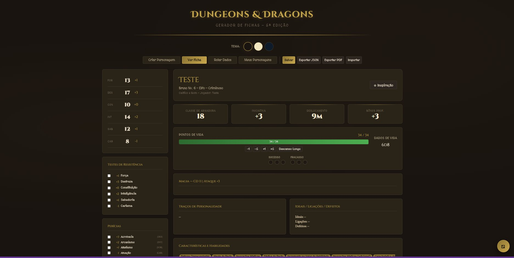
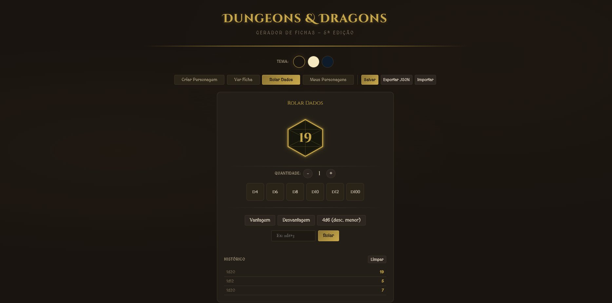

# D&D 5e — Gerador de Fichas de Personagem

Aplicação web para criar e gerenciar fichas de personagem de **Dungeons & Dragons 5ª Edição**, desenvolvida com React e Vite. Funciona completamente no navegador, sem necessidade de servidor ou banco de dados.

---

## Screenshots






---

## Funcionalidades

- **Wizard em 8 passos** para criação de personagens do zero (informações básicas, raça, classe, atributos, perícias, combate, equipamentos, magias e backstory)
- **Dado D20 animado** com SVG temático — crítico e falha crítica destacados visualmente
- **Rolagem de dados completa** — d4, d6, d8, d10, d12, d20, d100, com vantagem, desvantagem e notação livre (ex: `2d6+3`)
- **Ficha de personagem** com HP tracker, slots de magia, inventário e condições
- **Exportação em PDF** fiel à ficha exibida em tela
- **Exportação / importação JSON** para backup e compartilhamento de personagens
- **Múltiplos personagens** salvos no navegador via localStorage
- **3 temas visuais** — Grimório Sombrio, Pergaminho e Cristal Élfico

---

## Tecnologias

- [React](https://react.dev/)
- [Vite](https://vitejs.dev/)
- JavaScript (ES6+)
- CSS3

---

## Como rodar localmente

```bash
# Clone o repositório
git clone https://github.com/TomaziProgramas/D-D-5e-Gerador-de-Fichas-de-Personagem.git

# Entre na pasta do projeto
cd D-D-5e-Gerador-de-Fichas-de-Personagem

# Instale as dependências
npm install

# Inicie o servidor de desenvolvimento
npm run dev
```

Acesse `http://localhost:5173` no navegador.

---

## Estrutura do Projeto

```
src/
├── components/
│   ├── dice/         # Componente de rolagem de dados
│   ├── sheet/        # Ficha de personagem
│   └── steps/        # Etapas do wizard de criação
├── data/             # Dados de raças, classes, magias, etc.
├── hooks/            # Hook useCharacter
├── styles/           # Estilos globais e temas
└── utils/            # Cálculos de atributos e dados
```

---

## Licença

Este projeto está licenciado sob a licença [MIT](LICENSE).